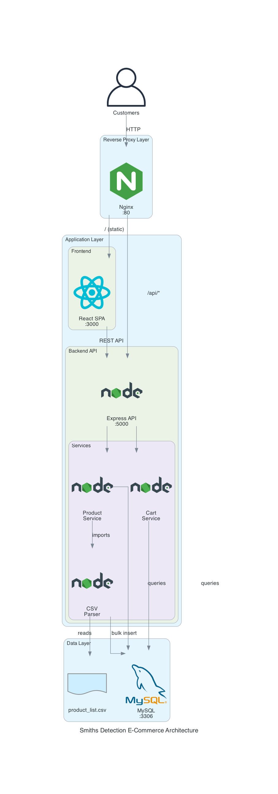

# Smiths Detection E-Commerce Platform

A web-based e-commerce platform for browsing and purchasing detection equipment products.

## 🚀 Implementation Status

**Backend: 60% Complete** | **Frontend: 10% Complete** | **Chatbot: 100% Complete** | **Overall: 40% Complete**

### ✅ Completed Components
- Database schema with products and cart_items tables
- CSV parser for product data import
- ProductService with full CRUD operations
- CartService with cart management operations
- Product API endpoints (GET /api/products, GET /api/products/:id)
- Cart API endpoints (POST /api/cart, GET /api/cart)
- Automatic product import on server startup
- Comprehensive error handling and logging
- **Shopping Assistant Chatbot Service** (Python/Strands SDK/AWS Bedrock Nova Pro)
  - Natural language product search and recommendations
  - Conversational cart management
  - Session-based conversation context
  - Independent microservice deployment

### 🔄 In Progress
- Remaining cart API endpoints (PUT, DELETE)
- Backend middleware (error handler, CORS, body parser)
- Frontend React components
- API client integration

### 📋 Planned
- Frontend pages (Home, Product Detail, Cart)
- Frontend chatbot popup interface
- Navigation and routing
- Deployment configuration
- End-to-end testing

## Architecture

- **Frontend**: React 18 SPA with React Router
- **Backend**: Node.js/Express REST API
- **Chatbot**: Python/FastAPI with Strands Agents SDK and AWS Bedrock Nova Pro
- **Database**: MySQL 8.0+
- **Deployment**: Single server with Nginx reverse proxy

## Architecture Diagrams

Visual representations of the system architecture are available in the [diagrams folder](./diagrams/):



**Available Diagrams:**
- [Complete System Architecture](./diagrams/complete-system-architecture.png) - Full 3-tier architecture overview
- [Backend Service Architecture](./diagrams/backend-service-architecture.png) - Service layer details
- [Data Flow - Product Browsing](./diagrams/data-flow-product-browsing.png) - Product browsing flow
- [Data Flow - Add to Cart](./diagrams/data-flow-add-to-cart.png) - Cart addition flow
- [API Endpoints Status](./diagrams/api-endpoints-status.png) - Implementation status
- [Testing Architecture](./diagrams/testing-architecture.png) - Test infrastructure

See [diagrams/README.md](./diagrams/README.md) for detailed descriptions of each diagram.

## Project Structure

```
.
├── backend/                    # Node.js/Express backend API
│   ├── config/
│   │   └── database.js        # ✅ Database connection pool
│   ├── routes/
│   │   ├── products.js        # ✅ Product API routes
│   │   └── cart.js            # ✅ Cart API routes (partial)
│   ├── services/
│   │   ├── productService.js  # ✅ Product business logic
│   │   ├── cartService.js     # ✅ Cart business logic
│   │   └── csvParser.js       # ✅ CSV parsing utility
│   ├── __tests__/             # ✅ Comprehensive test suite
│   ├── server.js              # ✅ Main server entry point
│   ├── package.json           # Backend dependencies
│   └── .env                   # Environment configuration
├── chatbot/                    # ✅ Python chatbot service
│   ├── config.py              # ✅ Configuration management
│   ├── logger.py              # ✅ Structured logging
│   ├── models.py              # ✅ Data models
│   ├── backend_client.py      # ✅ Backend API client
│   ├── agent.py               # ✅ Strands agent logic
│   ├── server.py              # ✅ FastAPI application
│   ├── main.py                # ✅ Entry point
│   ├── start.sh               # ✅ Startup script
│   ├── requirements.txt       # Python dependencies
│   ├── .env.example           # Environment template
│   └── README.md              # Chatbot documentation
├── frontend/                   # React frontend SPA
│   ├── src/                   # ⏳ React source code (in progress)
│   ├── public/                # Static assets
│   └── package.json           # Frontend dependencies
├── database/                   # Database schema and setup
│   ├── schema.sql             # ✅ MySQL schema definition
│   └── README.md              # Database setup instructions
├── generated-diagrams/         # Architecture diagrams
│   ├── smiths-detection-current-architecture.png
│   └── api-endpoints-status.png
├── docs/                       # Project documentation
│   ├── API.md                 # API documentation
│   ├── ARCHITECTURE.md        # Architecture details
│   └── IMPLEMENTATION-GUIDE.md
└── product_list.csv           # ✅ Product catalog data (74 products)

```

## Quick Start

### 1. Database Setup

```bash
cd database
mysql -u root -p < schema.sql
```

See `database/README.md` for detailed instructions.

### 2. Backend Setup

```bash
cd backend
npm install
cp .env.example .env
# Edit .env with your database credentials
npm start
```

Backend will run on http://localhost:5000

### 3. Chatbot Service Setup (Optional)

```bash
cd chatbot
python -m venv .venv
source .venv/bin/activate  # On Windows: .venv\Scripts\activate
pip install -r requirements.txt
cp .env.example .env
# Edit .env with AWS credentials and backend URL
./start.sh
```

Chatbot service will run on http://localhost:8000

See `chatbot/README.md` for detailed setup instructions.

### 4. Frontend Setup

```bash
cd frontend
npm install
npm start
```

Frontend will run on http://localhost:3000

## Configuration

### Environment Variables

Backend, chatbot, and frontend require environment configuration:

- **Backend**: Copy `backend/.env.example` to `backend/.env` and configure database credentials
- **Chatbot**: Copy `chatbot/.env.example` to `chatbot/.env` and configure AWS credentials and backend URL
- **Frontend**: Uses `.env.development` for local development (already configured)

See [Environment Setup Guide](./docs/ENVIRONMENT-SETUP.md) for detailed configuration instructions.

### Chatbot Environment Variables

The chatbot service requires the following environment variables:

**Required:**
- `AWS_ACCESS_KEY_ID`: AWS access key for Bedrock authentication
- `AWS_SECRET_ACCESS_KEY`: AWS secret key for Bedrock authentication
- `BACKEND_API_URL`: Base URL of Node.js backend (e.g., http://localhost:5000)

**Optional:**
- `AWS_SESSION_TOKEN`: AWS session token for temporary credentials
- `AWS_REGION`: AWS region (default: us-east-1)
- `CHATBOT_PORT`: Service port (default: 8000)
- `LOG_LEVEL`: Logging level (default: INFO)
- `CORS_ORIGINS`: Allowed CORS origins (default: http://localhost:3000)

See `chatbot/.env.example` for complete list.

## Deployment

For production deployment instructions, see:
- [Deployment Guide](./docs/DEPLOYMENT.md) - Complete deployment walkthrough
- [Deployment Checklist](./docs/DEPLOYMENT-CHECKLIST.md) - Step-by-step checklist
- [Environment Setup](./docs/ENVIRONMENT-SETUP.md) - Environment configuration details

### Chatbot Service Deployment

The chatbot service runs independently on port 8000 and can be deployed on the same server as the backend:

1. Install Python 3.9+ and create virtual environment
2. Install dependencies: `pip install -r chatbot/requirements.txt`
3. Configure environment variables in `chatbot/.env`
4. Run service: `cd chatbot && ./start.sh`

For production, use a process manager (systemd/supervisor) and configure Nginx to proxy `/api/chat` and `/health` endpoints to port 8000.

See [Chatbot README](./chatbot/README.md) for detailed deployment instructions including systemd configuration and Nginx setup.

## Testing

### Automated Tests
Run the comprehensive test suite:

```bash
cd backend
npm test
```

**Test Coverage:**
- 89 passing tests
- Integration tests (server startup, routes)
- Service layer tests (ProductService, CartService)
- Property-based tests using fast-check (100+ iterations)

### Manual API Testing
Test all API endpoints interactively:

```bash
./test-api.sh
```

This script validates:
- All implemented endpoints
- HTTP status codes
- Error handling
- Cart operations
- JSON response formatting

**Requirements:** Server running on http://localhost:5000, Python 3, curl

## Development

- Backend: `npm run dev` (with nodemon for auto-reload)
- Frontend: `npm start` (with hot reload)
- Tests: `npm test` in respective directories

## API Endpoints

### Products API ✅
- `GET /api/products` - List all products
- `GET /api/products/:id` - Get product by ID

### Cart API (Partial) 🔄
- `POST /api/cart` - Add item to cart ✅
- `GET /api/cart` - Get cart contents ✅
- `PUT /api/cart/:id` - Update item quantity ⏳
- `DELETE /api/cart/:id` - Remove item from cart ⏳

### Chatbot API ✅
- `POST /api/chat` - Send message to chatbot and receive response
- `GET /health` - Check chatbot service health status

See [API Documentation](./docs/API.md) for detailed endpoint specifications.
See [Chatbot Documentation](./chatbot/README.md) for chatbot API details.

## Features

- Product catalog browsing
- Product detail view
- Shopping cart management
- Add/update/remove cart items
- Persistent cart storage
- CSV-based product import
- **AI-powered shopping assistant chatbot**
  - Natural language product search
  - Conversational recommendations
  - Cart management through chat
  - Session-based conversation context

## Requirements

- Node.js 16+
- MySQL 8.0+
- npm or yarn
- Python 3.9+ (for chatbot service)
- AWS account with Bedrock access (for chatbot service)

## License

Proprietary - Smiths Detection
